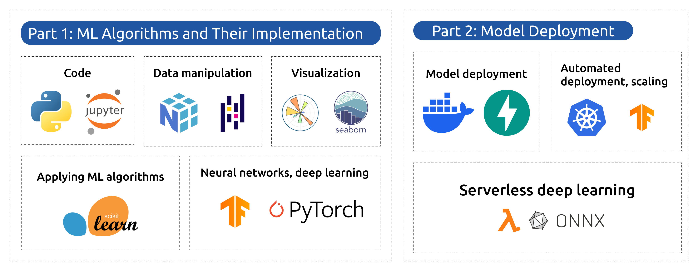

  

  # Machine Learning Zoomcamp

  ### Norman Angel | Data Scientist 

  [![Contributors][contributors-shield]][contributors-url]
  [![Forks][forks-shield]][forks-url]
  [![Stars][stars-shield]][stars-url]
  [![Issues][issues-shield]][issues-url]
  [![License][license-shield]][license-url]

   

  [![LinkedIn][linkedin-shield]][linkedin-url]
  [![Twitter][twitter-shield]][twitter-url]

    

  
  
   

---

<!-- MARKDOWN LINKS & IMAGES -->
[contributors-shield]: https://img.shields.io/github/contributors/anormanangel/Machine-Learning-Zoomcamp.svg?style=for-the-badge
[contributors-url]: https://github.com/anormanangel/Machine-Learning-Zoomcamp/graphs/contributors
[forks-shield]: https://img.shields.io/github/forks/anormanangel/Machine-Learning-Zoomcamp.svg?style=for-the-badge
[forks-url]: https://github.com/anormanangel/Machine-Learning-Zoomcamp/network/members
[stars-shield]: https://img.shields.io/github/stars/anormanangel/Machine-Learning-Zoomcamp.svg?style=for-the-badge
[stars-url]: https://github.com/anormanangel/Machine-Learning-Zoomcamp/stargazers
[issues-shield]: https://img.shields.io/github/issues/anormanangel/Machine-Learning-Zoomcamp.svg?style=for-the-badge
[issues-url]: https://github.com/anormanangel/Machine-Learning-Zoomcamp/issues
[license-shield]: https://img.shields.io/github/license/anormanangel/Machine-Learning-Zoomcamp.svg?style=for-the-badge
[license-url]: https://github.com/anormanangel/Machine-Learning-Zoomcamp/blob/main/LICENSE
[linkedin-shield]: https://img.shields.io/badge/LinkedIn-0077B5?style=for-the-badge&logo=linkedin&logoColor=white
[linkedin-url]: https://www.linkedin.com/in/anormanangel/
[twitter-shield]: https://img.shields.io/badge/X%20(Twitter)-000000?style=for-the-badge&logo=x&logoColor=white
[twitter-url]: https://x.com/anormanangel

## 📋 Table of Contents

- [📚 Course Structure](#course-structure)  
  - [Part 1: Machine Learning Foundations](#part-1-machine-learning-foundations)  
    - [01 – Introduction](#01--introduction)  
    - [02 – Linear Regression & Feature Engineering](#02--linear-regression--feature-engineering)  
    - [03 – Classification & Model Evaluation](#03--classification--model-evaluation)  
    - [04 – Decision Trees & Ensemble Learning](#04--decision-trees--ensemble-learning)  
    - [05 – Neural Networks & Deep Learning](#05--neural-networks--deep-learning)  
  - [Part 2: Model Deployment](#part-2-model-deployment)  
    - [06 – Web Services with FastAPI](#06--web-services-with-fastapi)  
    - [07 – Containerization with Docker](#07--containerization-with-docker)  
    - [08 – Cloud Deployment on AWS Lambda](#08--cloud-deployment-on-aws-lambda)  
    - [09 – Orchestration with Kubernetes](#09--orchestration-with-kubernetes)  

## Tools

  [![Python][Python-shield]][Python-url] 
  [![NumPy][NumPy-shield]][NumPy-url] 
  [![Pandas][Pandas-shield]][Pandas-url] 
  [![Scikit-Learn][Scikit-shield]][Scikit-url] 
  [![TensorFlow][TensorFlow-shield]][TensorFlow-url] 
  [![PyTorch][PyTorch-shield]][PyTorch-url] 
  [![FastAPI][FastAPI-shield]][FastAPI-url] 
  [![Docker][Docker-shield]][Docker-url] 
  [![AWS Lambda][AWS-shield]][AWS-url] 
  [![Kubernetes][Kubernetes-shield]][Kubernetes-url] 
  [![TensorFlow Runtime][TFRuntime-shield]][TFRuntime-url]

(<a href="#readme-top">back to top</a>)

<!-- BADGES LINKS -->
[Python-shield]: https://img.shields.io/badge/Python-3776AB?style=for-the-badge&logo=python&logoColor=white
[Python-url]: https://www.python.org/

[NumPy-shield]: https://img.shields.io/badge/NumPy-013243?style=for-the-badge&logo=numpy&logoColor=white
[NumPy-url]: https://numpy.org/

[Pandas-shield]: https://img.shields.io/badge/Pandas-150458?style=for-the-badge&logo=pandas&logoColor=white
[Pandas-url]: https://pandas.pydata.org/

[Scikit-shield]: https://img.shields.io/badge/Scikit--Learn-F7931E?style=for-the-badge&logo=scikitlearn&logoColor=white
[Scikit-url]: https://scikit-learn.org/

[TensorFlow-shield]: https://img.shields.io/badge/TensorFlow-FF6F00?style=for-the-badge&logo=tensorflow&logoColor=white
[TensorFlow-url]: https://www.tensorflow.org/

[PyTorch-shield]: https://img.shields.io/badge/PyTorch-EE4C2C?style=for-the-badge&logo=pytorch&logoColor=white
[PyTorch-url]: https://pytorch.org/

[FastAPI-shield]: https://img.shields.io/badge/FastAPI-009688?style=for-the-badge&logo=fastapi&logoColor=white
[FastAPI-url]: https://fastapi.tiangolo.com/

[Docker-shield]: https://img.shields.io/badge/Docker-2496ED?style=for-the-badge&logo=docker&logoColor=white
[Docker-url]: https://www.docker.com/

[AWS-shield]: https://img.shields.io/badge/AWS_Lambda-FF9900?style=for-the-badge&logo=aws&logoColor=white
[AWS-url]: https://aws.amazon.com/lambda/

[Kubernetes-shield]: https://img.shields.io/badge/Kubernetes-326CE5?style=for-the-badge&logo=kubernetes&logoColor=white
[Kubernetes-url]: https://kubernetes.io/

[TFRuntime-shield]: https://img.shields.io/badge/TensorFlow_Runtime-FF6F00?style=for-the-badge&logo=tensorflow&logoColor=white
[TFRuntime-url]: https://www.tensorflow.org/tfx/runtime

